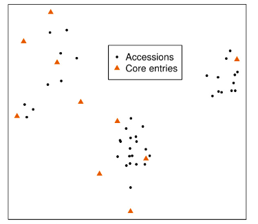
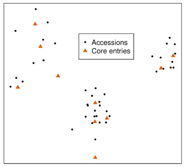
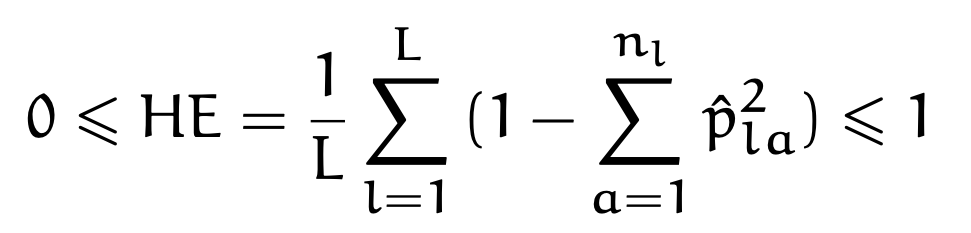
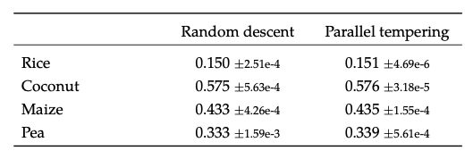
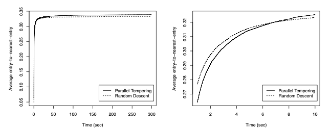
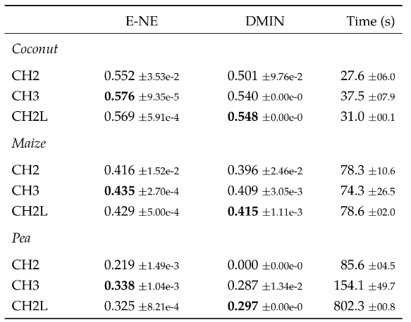
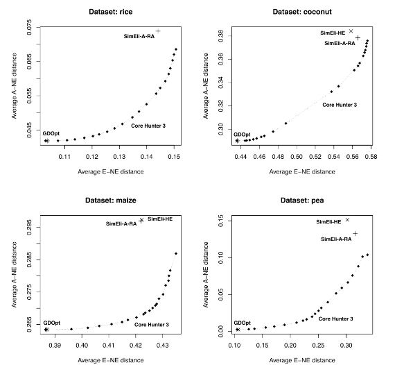
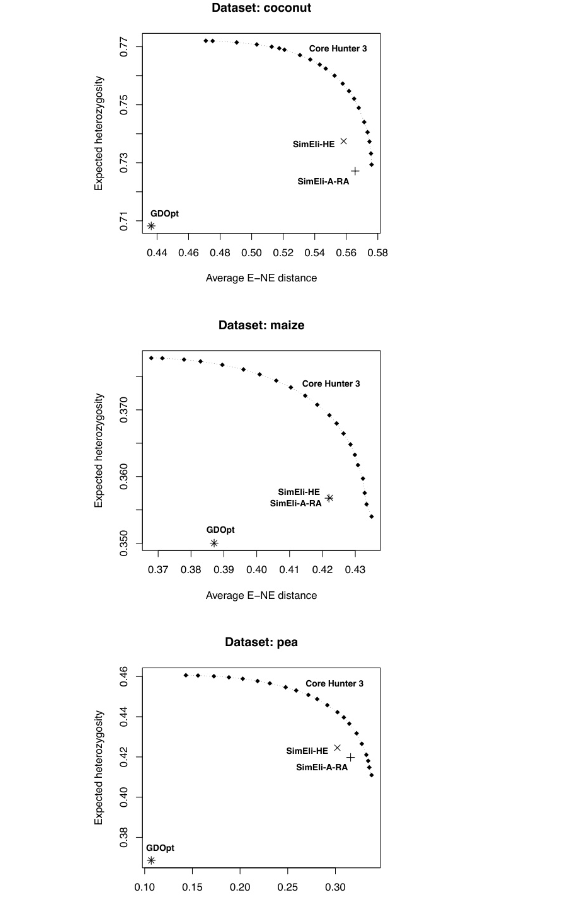
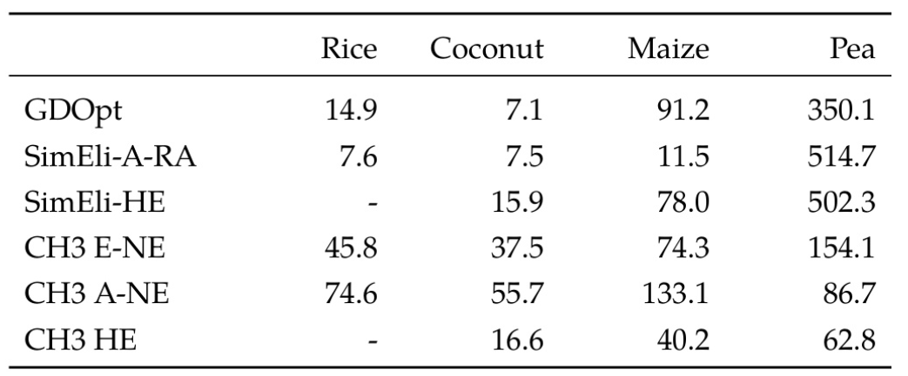

# Core Hunter

Felix Li · <felix.li12397@gmail.com>  

---

## Core Hunter是什么？

- 用于核心f种质筛选的生物信息学工具  
- 从大规模遗传资源库中选取子集  
- 本报告主要讲解Core Hunter3各个算法，然后跟其他核心种质筛选工具做对比

---

## 评估指标

---

## 条目至最近条目(E-NE)

- 每个选定种质与最近其他条目间的平均距离  
- 最大化 → 高度多样化的核心集合  

---

## 全库至最近条目(A-NE)

- 每个种质与最相似核心条目的平均距离  
- 最小化 → 能最佳代表完整收集中所有个体种质的核心集合  

---

## 位点平均期望杂合度 (HE)

- 评估核心种质等位基因丰富度  

---

# Core Hunter 3 核心算法

---

## 核心功能
- 主要算法：
  - 随机下降算法（基础）
  - 并行回火算法（默认）
- 支持多目标加权指数优化
- 使用预设停止条件控制运行时间

---

## 随机下降算法
- **流程**：
  1. 随机选择初始核心集
  2. 随机交换"已选-未选"样本
  3. 仅接受质量提升的交换
- **优势**：
  - 简单直接

---

## 并行回火算法（默认）
- **流程**：
  - 10个并行搜索副本
  - 不同温度设置（高温更易接受次优解）
  - 定期交换副本间的解
- **优势**：
  - 低温副本保证收敛
  - 高温副本探索新区域

---

## 算法精度对比

- **核心发现**：
  - 并行回火在所有测试数据集上表现更优
  - **稳定性显著提升**：
    - 并行回火的标准差降低
    - 例如椰子数据：±3.18e-5 vs ±5.63e-4

---

## 过程对比

- **动态过程分析**：
  - **随机下降**：前7秒快速提升，适合快速预览
  - **并行回火**：7秒后反超，长期优化能力更强

---

## 实践建议
- **首选配置**：CH3默认并行回火
- **快速场景**：随机下降（小数据集）
- **精准需求**：延长并行回火运行时间

---

## 版本性能对比

- **CH2**  
  - 混合副本搜索: 并行回火 + 构造启发式LR  
    - 构造性启发式算法  
    - 从空集开始逐步添加最优种质  
    - 每次迭代强制保持高最小距离
  - 专为优化最小距离设计  

- **CH3**  
  - 默认并行回火：  
    - 专注优化E-NE距离    

---

## 版本性能对比

- **测试方案**：
  - 10次独立运行取均值±标准差
- **停止条件**：
  - CH3：10秒无改进即停止
  - CH2: 10秒无改进即停止
  - CH2L: 确保LR副本完成

---

## 版本性能对比

---

## 版本性能对比
- **CH3核心优势**：
  - **质量更高**：E-NE值全面超越CH2
  - **速度更快**：豌豆数据集154秒 vs CH2L的802秒
  - **更稳定**：自动停止条件无需手动调参

---

## 对比算法：GDOpt
- **目标**：  
  - 专为最小化A-NE距离设计  
  - 确保全库每个种质都能在核心中找到"代表"  

- **流程**：  
  1. 识别数据中心点
  2. 以中心点为锚点分区  
  3. 选择分区代表作为核心种质

---

## 对比算法：SimEli
- **目标**：  
  - 迭代移除最相似种质对之一  
  - 淘汰标准：  
    - 最大化剩余种质距离 (SimEli-A-RA)  
    - 最大化预期杂合度 (SimEli-HE)
  - 强调E-NE优化  

---

## CH3 vs GDOpt vs SimEli

---

## CH3 vs GDOpt vs SimEli

- **代表性**  
  1. GDOpt：专攻A-NE 
  2. CH3: 逼近GDOpt
  3. SimEli

- **多样性**  
  1. CH3：E-NE全面领先  
  2. SimEli-A-RA
  3. GDOpt 

---

## 等位基因丰富度对比 (HE)

---

## 等位基因丰富度对比 (HE)
- **HE表现**：  
  - GDOpt 显著低于其他
  - SimEli-HE表现更好，但CH3能够在HE和E-NE同时优于SimEli

---

## 速度性

---

## 速度性

- **小数据集**：  
  - GDOpt/SimEli快 
  - 因CH3有并行回火 

- **大数据集**：  
  - CH3反超（豌豆数据集快3倍）  
  - 并行回火发挥多核优势 

---

## 速度性

- **CH3模式影响**：  
  - 优化HE最快（简单指标）  
  - 优化A-NE最慢（计算密集）

---

## 总结：CH3优势
  
  - 首创E-NE/A-NE双目标优化  
  - "多样性-代表性"权衡
  - 大数据集效率提升
  - 支持基因型+表型数据 
